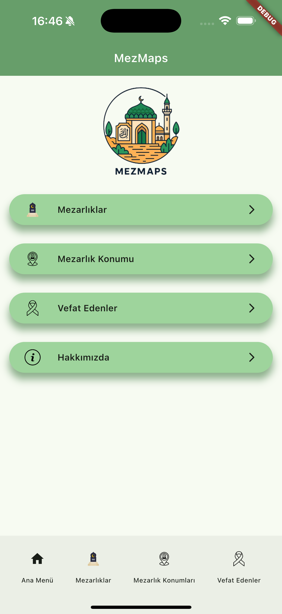
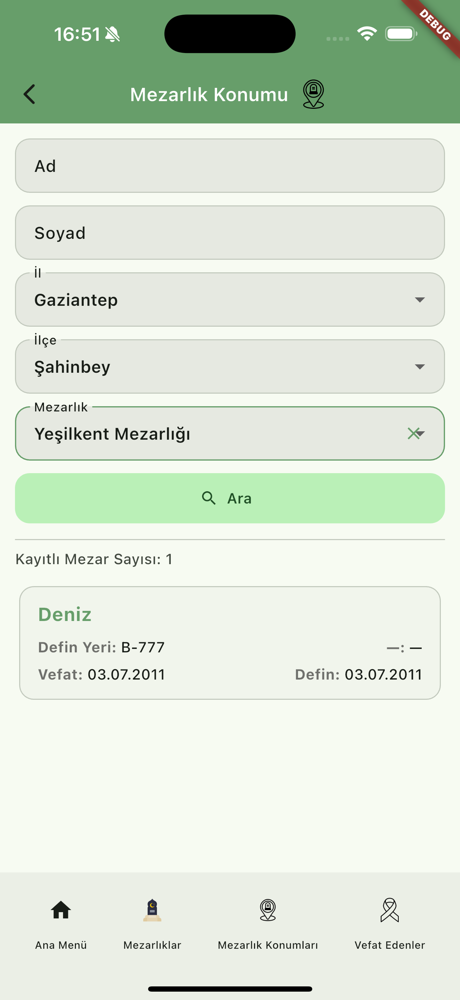
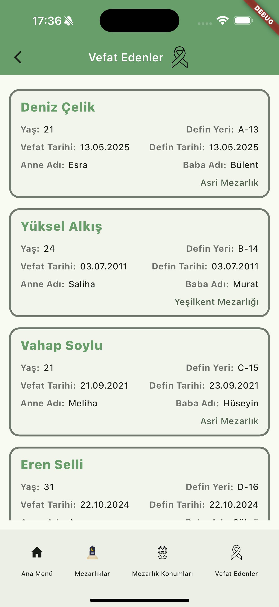

# MezMaps

**MezMaps**, mezarlık alanlarında dijital navigasyon desteği sunan bir mobil uygulamadır.  
Kullanıcılar, il–ilçe–mezarlık bazlı arama yaparak kayıtlı mezar bilgilerine ulaşabilir,  
defin konumlarını görüntüleyebilir ve mezarlıkları harita üzerinde inceleyebilir.

---

## 🧭 Özellikler

- 📍 **Mezarlık Konumu Bulma:**  
  Ad, soyad, il, ilçe ve mezarlık bilgilerine göre arama yapılabilir.  
  Arama sonucunda defin yeri, tarih ve mezar konumu listelenir.

- 🪦 **Mezarlıklar Sayfası:**  
  Şehirlere ve ilçelere göre mezarlık listeleri gösterilir.  
  “Hepsini Haritada Görüntüle” seçeneği ile toplu görüntüleme yapılabilir.

- ⚰️ **Vefat Edenler Sayfası:**  
  Tüm kayıtlı kişiler detaylı olarak listelenir (yaş, vefat/defin tarihi, anne-baba adı, mezarlık adı vb.).

- ℹ️ **Hakkımızda Sayfası:**  
  Uygulamanın amacı ve proje hakkında bilgilendirme sunar.

- 🗺️ **Modern ve Basit Arayüz:**  
  Kullanıcı dostu sade tasarım ve açık tonlu yeşil tema yapısı.

---

## 🖼️ Ekran Görselleri

| Ana Menü | Mezarlıklar | Mezarlık Konumu | Vefat Edenler |
|-----------|--------------|------------------|----------------|
|  |  |  |  |

---

## 🛠️ Kullanılan Teknolojiler

| Teknoloji | Açıklama |
|------------|----------|
| **Flutter** | Mobil uygulama geliştirme altyapısı |
| **Dart** | Uygulamanın ana programlama dili |
| **Provider / Cubit (State Management)** | Ekranlar arası veri akışı ve durum yönetimi |
| **Google Maps / URL Launcher** | Harita bağlantılarını açmak ve konum görüntüleme |
| **Clean Architecture Yaklaşımı** | Modüler ve sürdürülebilir yapı |
| **Custom Widgets & Common Module** | Tekrarlayan bileşenlerin yeniden kullanılabilir hale getirilmesi |

---

## 🧩 Mimarî Yapı

    lib/
    │
    ├── feature/
    │   ├── home/
    │   ├── cemeteries/
    │   ├── grave_search/
    │   ├── deaths/
    │   └── about/
    │
    ├── product/
    │   ├── widgets/
    │   ├── state/
    │   ├── utility/
    │   ├── theme/
    │   ├── helpers/
    │   └── mock/
    │
    ├── module/
    │  ├── gen/
    │  └── common/

> 🔹 **feature** → Ekran bazlı yapılar  
> 🔹 **product** → Ortak bileşenler, temalar ve yardımcı sınıflar  
> 🔹 **gen** → Otomatik oluşturulan kodlar (ikon, renk, font)  
> 🔹 **common** → Ortak kullanılan extension ve fonksiyonlar  

---

## 🚀 Gelecek Güncellemeler

- [ ] Firebase / Supabase entegrasyonu ile gerçek veri tabanı bağlantısı  
- [ ] Harita üzerinde dinamik rota gösterimi  
- [ ] Kullanıcı oturumu ve giriş sistemi  
- [ ] Favori mezarlıkları kaydetme özelliği  

---

## 📱 Desteklenen Platformlar

| Platform | Durum |
|-----------|--------|
| Android | ✅ Test Edildi |
| iOS | ✅ Test Edildi |

